## trans出来之前：
### 无注意力的RNN：  
        - encoder ： 把数据都压缩成一个*固定大小*的向量
        - decoder ： 根据这个向量去生成
### 有注意力的RNN：
        - encoder ： n个词有n个输出向量h1、h2...hn ，不再压缩成一个固定大小的向量
        - decoedr ： 将当前的query与所有输入h1、h2...hn进行相似度比较，动态计算出注意力权重(通过softmax)

-----------------------
# 从 attention 到 self-attention
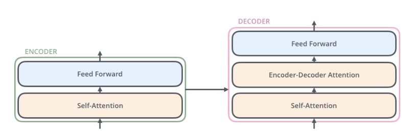


### 词嵌入层：
### 数据流： 
#### 1.输入： 
**实际处理时不会只处理一个patch，而是把成百上千个patch包装成一个batch来进行并行计算。**
        >batch_size = 32 一次处理32个patch
        >Input: [32,100] 含义： 我们有32个独立的 patch，每个 patch 都是一个包含100个采样点的一维向量
#### 2.嵌入层：
```
torch.nn.Linear(in_features=100, out_features=512)
```
权重矩阵W   形状[100,512]    共512000个参数
偏置b       形状[512]
#### 3.计算
$Output = Input \cdot W + b$
形状[32,512]       [batch_size,out_features]


------------

## 自注意力的非矩阵计算
随机初始化Wq、Wk、Wv
### 1.逐个计算，生成q、k、v
每个embedding都有三个向量 q  k  v （这三个的维度一般都小于embedding的维度）
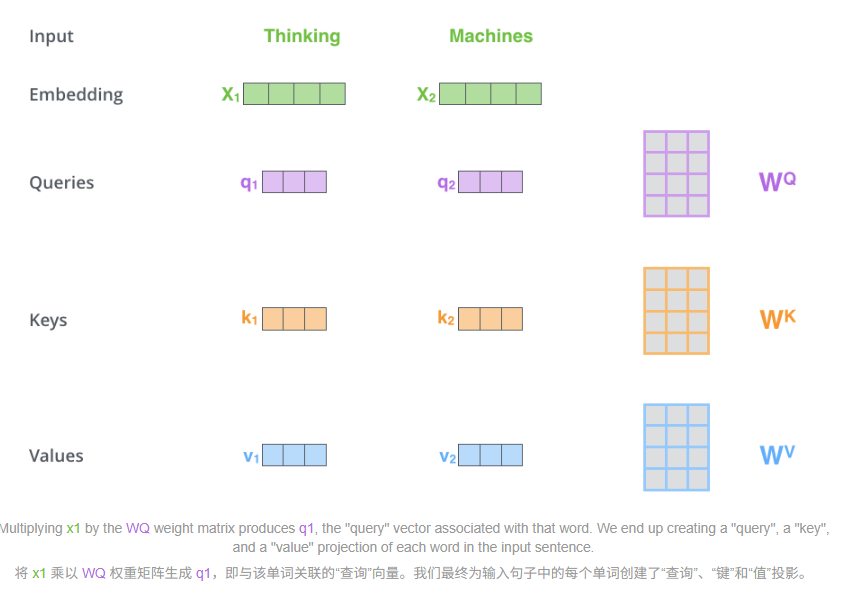
q1 = x1 * Wq
k1 = x1 * Wk
v1 = x1 * Wv
### 2.注意力评分
q1 * k1 = score1 ， q1 * k2 = score2， ...  q1 * kn = socren
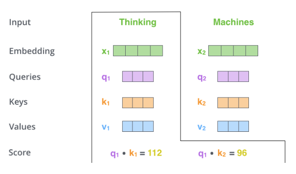
然后就是除以向量维度的平方根
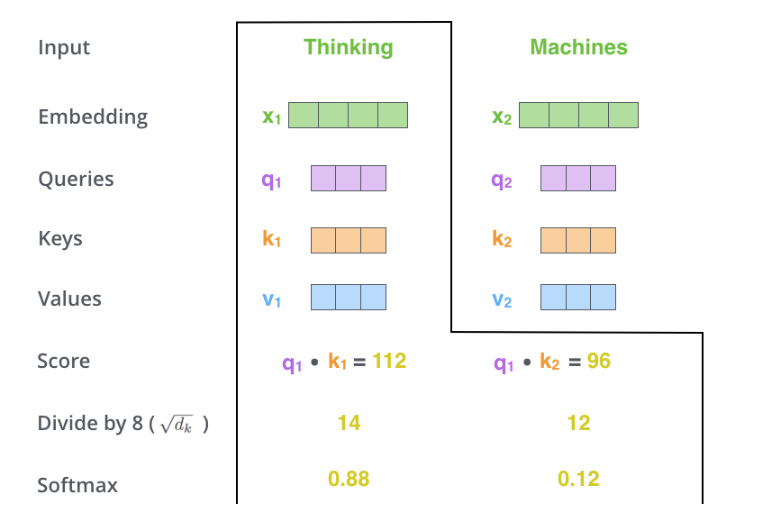
得到**“关注度权重”**     eg:weight_1 =  [0.55,0.21,...,0.1]总和为1

### 3.
将关注度权重乘以V   得到**注意力表示**（上下文向量）  
加权求和
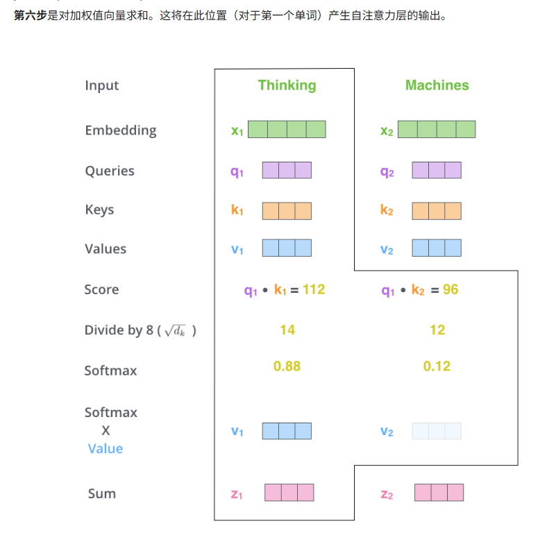

## 自注意力的矩阵计算
### 1.直接矩阵点积
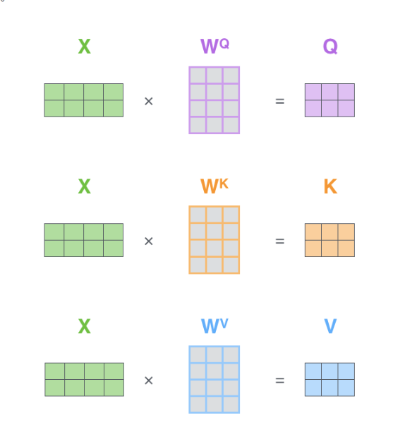
### 2.一个公式解决
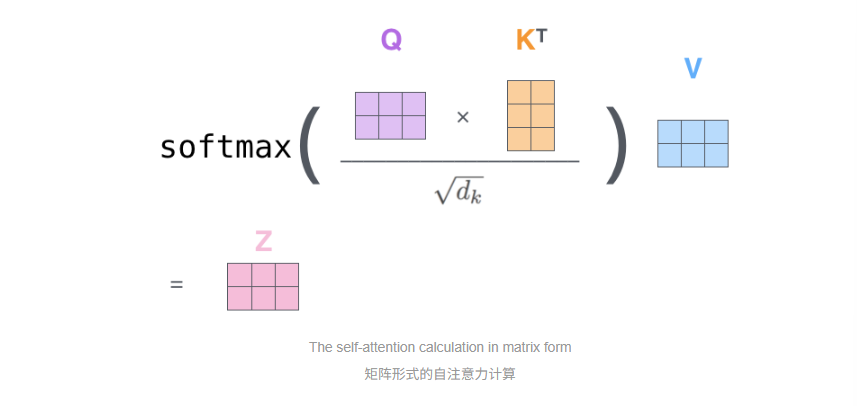
----------------

# 多头注意力机制
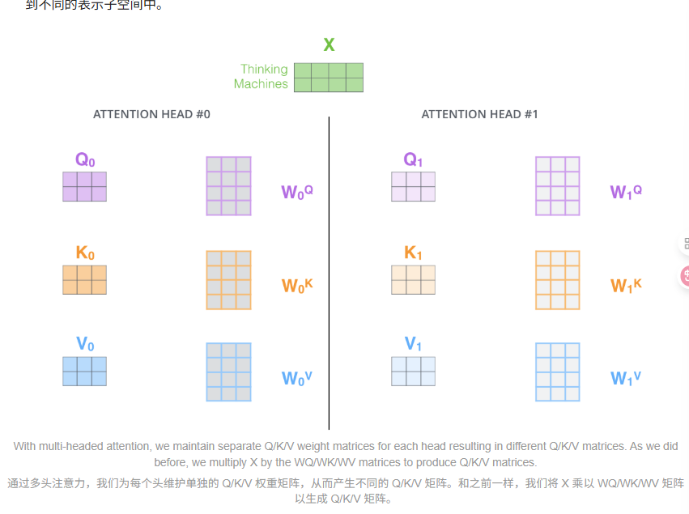
用了8个注意力头会得到8个矩阵Z，但是前馈层不需要八个矩阵，所以要压缩，将它们乘以一个额外的权重矩阵 WO即可
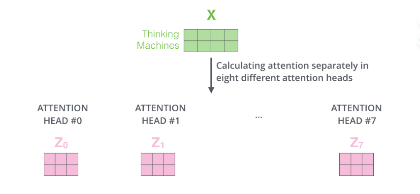
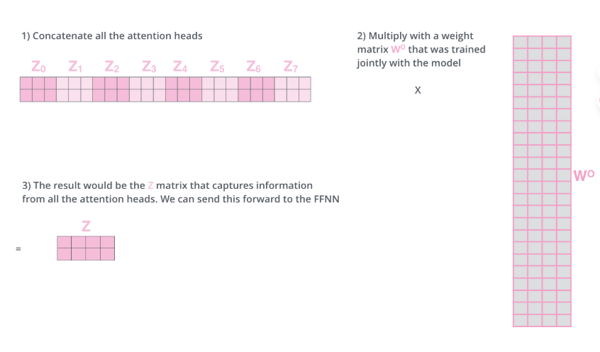


### 总视图：
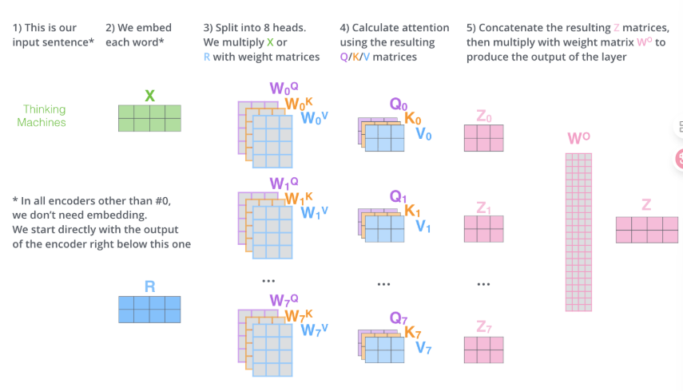
-------------


# 位置编码
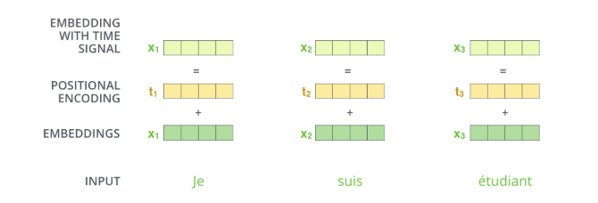

# 残差
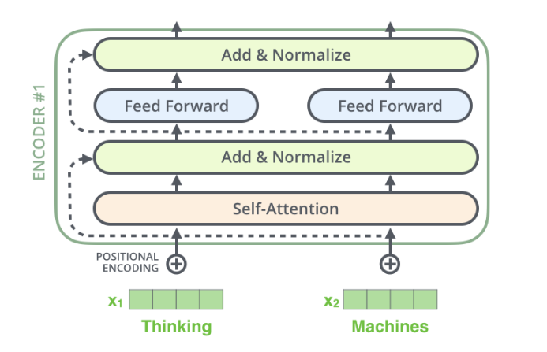
向量细节可视化：
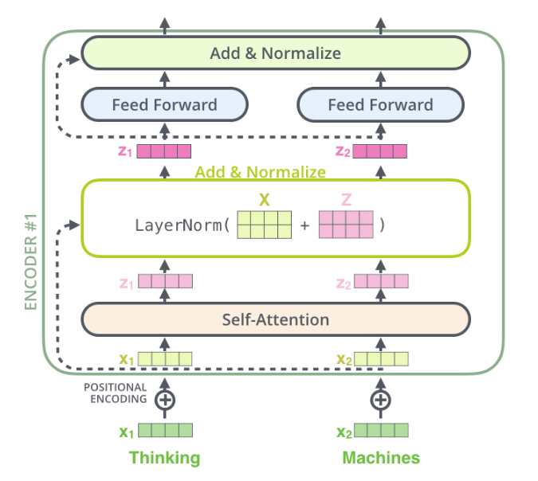
# 层归一化
**不是在一批数据（batch）之间进行比较，而是在一个词向量的内部维度之间进行比较和缩放，与相邻的词向量无关，与批次里有多少个patch无关（BN就相反，批归一化BN是看一个batch内的所有patch的一个维度，但是当patch很少时，BN就没用了，而且也不适用于可变长度）**

