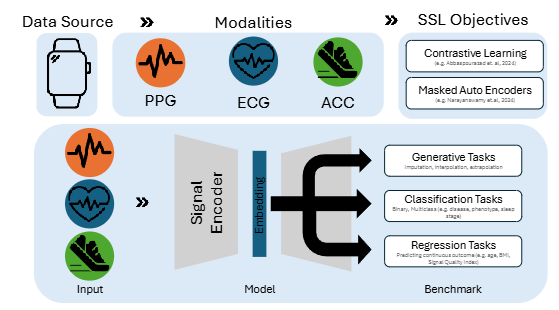



# Foundation Models for Physiological Signals:Opportunities and Challenges 综述
## 简介
概述了关键数据模态以及需要强大、可泛化基础模型的内在挑战

## 信号
#### PPG： 
**光电容积脉搏波**，利用光源（通常是 LED）和光电探测器来测量皮肤表面血液循环的体积变化，血液通过动脉搏动时会吸收更多光线，反射或投射光线的波动形成波形。【腕戴设备通常使用绿光，因为其被血红蛋白强烈吸收，且相对于红光或红外光，对运动伪影的抵抗能力更强。】

从这一单一信号中，可以推导出*心率（HR）*、*心率变异性（HRV）*、*血氧饱和度（SpO2）*等关键健康指标，甚至可以推断*睡眠质量*

#### ECG：
**心电图**，单导心电图，有可能检测到心脏心律失常，尤其是心房颤动（AF），这是导致中风的主要原因

#### IMUs：
**惯性测量单元**，加速度计测量线性加速度，陀螺仪测量角速度，磁力计测量相对于地球磁场方向的姿态，用于追踪身体活动、分析步态模式、识别特定动作（例如跑步、坐着）以及检测跌倒——这对于老年人护理是一项关键应用

#### EDA（GSR）
**皮肤电活动**，测量与汗腺活动相关的皮肤电导率变化，为交感神经系统兴奋和情绪提供参考指标

---
## 挑战challenges
#### 信号质量与噪声
**运动伪影（MA）**，传感器相对于皮肤移动，破坏光学信号，并导致心率和其他衍生参数的测量不准确
**数据不完整性**
**异质性**，泛化问题

>可穿戴基础模型流程概述，采用自监督学习（SSL），如*对比学习*和*掩码自编码*，对信号编码器进行预训练，生成能够捕捉丰富时间特征和潜在跨模态关系的*嵌入*，这些嵌入被迁移到下游任务中，如生成任务（例如，插补、插值）、分类任务（例如，疾病状态、睡眠阶段）和回归任务（例如，年龄、BMI、信号质量指数）
>
>*嵌入*  Embedding ，其实就是信号中最重要的模式和特征被编码器编码后的一个某个长度的向量
>
>*对比学习* 让模型觉得锚点和正样本的嵌入向量在空间中尽可能靠近，让锚点和负样本的嵌入向量尽可能远离
>
>*掩码自编码（MAE）* 比如把ECG信号的75%mask out掉，25%的片段输入信号编码器生成嵌入，让解码器尝试仅根据这个嵌入把遮蔽的75%复原出来

---
## 基础模型范式下的生理信号基础模型
能够理解有缺失值的上下文的模型，这类模型学习到对这类缺失具有鲁棒性的潜在生理模式

#### 时间序列基础模型Time Series Foundation Models (TSFMs)
核心思想：在庞大且多样化的时间序列数据集上预训练一个单一的大型通用模型

主流架构：Transformer   自注意力机制 使模型不管元素的位置如何，优先权衡序列中不同元素的重要性

#### Tokenization of Time Series Data

>分词化——————>Transformer  ： 将连续的模拟信号转换为模型可以处理的离散符号序列的过程
>TSFMs内部架构区别：基于 补丁方法 和 非补丁方法（这里我想做成那种像大括号一样的分类）

一种趋势："图像化"时间序列数据   一轴是时间，另一轴代表不同的传感器通道或特征
————————>使用ViT

>时序数据的频域表示(“时频表示”)    同样能将一维的序列数据转换为类似图像的形式「升维」
>工具之一：连续小波变换（CWT） 将原始信号分解为其时频表示，创造出多尺度的表征  
>机制：通道感知注意力机制*       
>作用：处理不同模态之间的异质性*
>（与传统方法傅里叶变换不同，只有频率信息，无时间信息）

#### 处理多模态
融合来自不同传感器的信息可以产生更丰富和更鲁棒的表示
eg：LSM（大型传感器模型）

---
## 预训练范式

SSL 的*Pretext tasks*：代理任务，通过这些代理任务“逼迫”模型学到数据中蕴含的深层结构、模式和通用知识
代理任务：
>1.masking
>游戏规则： 取一段10秒的ECG信号，随机遮住（Mask out）中间的2秒。让模型看着前后的信号，把中间被遮住的2秒给“画”出来。
>
>学习目标： 为了能准确地复原信号，模型必须学会一个正常心跳波形（P波、QRS波、T波）的形态和它们之间的时间关系（时间依赖性）
>2.Contrastive Learning
>游戏规则：
>取一段“静息状态下”的ECG信号（样本A）。
>对它加一点随机噪声，生成样本A'。
>再另外取一段“跑步时”的ECG信号（样本B）。
>现在给模型看 A、A' 和 B，问它：“A' 和谁是‘一家人’？”
>
>学习目标： 为了能答对，模型必须学会忽略那些不重要的表面差异（如噪声），而去捕捉信号最本质的特征（比如“静息状态”下的心率和波形模式）
>3.Forecasting
>4.Cross-modal Alignment跨信号对齐

一个好的“表示”（嵌入）具有哪些：
>    时间依赖性：比如，在心电图中，P波之后必然会跟随着QRS波群。模型需要学到这种先后顺序关系
>    周期性
>    跨通道相关性：比如，当加速度计（IMU）显示身体在剧烈运动时，心率（来自ECG或PPG）通常会随之上升
