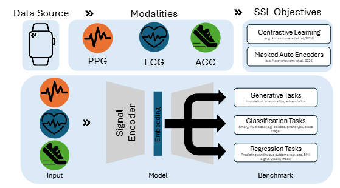



### Foundation Models for Physiological Signals:Opportunities and Challenges 综述
## 简介
概述了关键数据模态以及需要强大、可泛化基础模型的内在挑战

## 信号
# PPG： 
**光电容积脉搏波**，利用光源（通常是 LED）和光电探测器来测量皮肤表面血液循环的体积变化，血液通过动脉搏动时会吸收更多光线，反射或投射光线的波动形成波形。【腕戴设备通常使用绿光，因为其被血红蛋白强烈吸收，且相对于红光或红外光，对运动伪影的抵抗能力更强。】

从这一单一信号中，可以推导出*心率（HR）*、*心率变异性（HRV）*、*血氧饱和度（SpO2）*等关键健康指标，甚至可以推断*睡眠质量*

# ECG：
**心电图**，单导心电图，有可能检测到心脏心律失常，尤其是心房颤动（AF），这是导致中风的主要原因

# IMUs：
**惯性测量单元**，加速度计测量线性加速度，陀螺仪测量角速度，磁力计测量相对于地球磁场方向的姿态，用于追踪身体活动、分析步态模式、识别特定动作（例如跑步、坐着）以及检测跌倒——这对于老年人护理是一项关键应用

# EDA（GSR）
**皮肤电活动**，测量与汗腺活动相关的皮肤电导率变化，为交感神经系统兴奋和情绪提供参考指标

## 挑战challenges
# 信号质量与噪声
**运动伪影（MA）**，传感器相对于皮肤移动，破坏光学信号，并导致心率和其他衍生参数的测量不准确
**数据不完整性**
**异质性**，泛化问题

可穿戴基础模型流程概述，采用自监督学习（SSL），如*对比学习*和*掩码自编码*，对信号编码器进行预训练，生成能够捕捉丰富时间特征和潜在跨模态关系的*嵌入*，这些嵌入被迁移到下游任务中，如生成任务（例如，插补、插值）、分类任务（例如，疾病状态、睡眠阶段）和回归任务（例如，年龄、BMI、信号质量指数）

*嵌入*  Embedding ，其实就是信号中最重要的模式和特征被编码器编码后的一个某个长度的向量

*对比学习* 让模型觉得锚点和正样本的嵌入向量在空间中尽可能靠近，让锚点和负样本的嵌入向量尽可能远离

*掩码自编码（MAE）* 比如把ECG信号的75%mask out掉，25%的片段输入信号编码器生成嵌入，让解码器尝试仅根据这个嵌入把遮蔽的75%复原出来

## 基础模型范式下的生理信号基础模型
能够理解有缺失值的上下文的模型，这类模型学习到对这类缺失具有鲁棒性的潜在生理模式

# 时间序列基础模型Time Series Foundation Models (TSFMs)
核心思想：在庞大且多样化的时间序列数据集上预训练一个单一的大型通用模型

